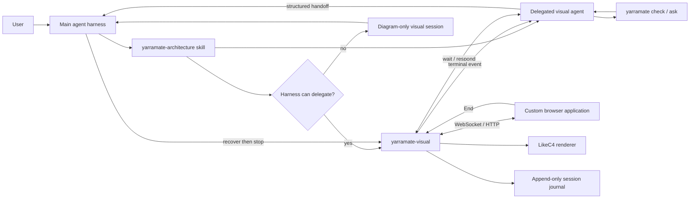

# Visual architecture conversations

**Status:** Approved design
**Date:** 2026-08-08
**Scope:** YarraMate package, canonical `yarramate-architecture` skill, and self-model

## Summary

Add a user-facing visual explanation journey initiated through the `yarramate-architecture` skill. A user may ask YarraMate to visually explain checked repository architecture, a general question, or design choices. The journey opens a custom browser application that combines LikeC4 rendering, descriptions, linked overview/detail views, and a chat widget.

A new sibling binary, `yarramate-visual`, owns the browser application, local transport, session journal, renderer lifecycle, recovery, and cleanup. It never calls a model provider. On capable agent harnesses, the main agent delegates a bounded visual agent that communicates with the browser through a blocking, versioned session protocol. On End or failure, the delegated agent returns a structured handoff and the main agent resumes. Unsupported harnesses receive the same renderer in diagram-only mode and continue the conversation in the main harness.

The main agent remains authoritative throughout. The visual agent cannot edit repository files or canonical YarraMate documents.

## Goals

- Let a user request a visual explanation using natural language in an agent harness.
- Render checked YarraMate architecture without converting inferred evidence into declared intent.
- Support explicitly labeled ad hoc diagrams for general questions and design choices.
- Present choices as a comparison overview linked to one detail view per option.
- Keep diagram discussion, selections, and revisions inside the browser when the harness supports delegation.
- Return control and a recoverable handoff to the main agent on End or any failure.
- Stop the local webserver and delete temporary artifacts when the visual conversation ends.
- Preserve a diagram-only fallback without additional model credentials.

## Non-goals

- A general-purpose browser coding agent.
- Repository or `.yarramate/` writes from the delegated visual agent.
- A model-provider client, credential store, or provider abstraction in `yarramate-visual`.
- A hosted or remotely accessible visualization service.
- Promotion of ad hoc conversation content into canonical architecture.
- Replacement of the existing LikeC4 export adapter or the stable semantic CLI.
- Resumable delegated agents after End; End terminates the child and server.

## User experience

### Entry point

The user asks an agent using `yarramate-architecture`, for example:

- “Visually explain this architecture.”
- “Show how this question relates to the current model.”
- “Compare these choices visually.”
- “Open a visual conversation about this flow.”

No new command is required from the user. The skill remains the public orchestration interface.

### Source authority

The journey is model-first:

1. For repository architecture, require a workspace that passes `yarramate check`.
2. Query the relevant canonical slice with `yarramate ask <workspace> "<topic>" --json`.
3. Prefer an authored LikeC4 view when it answers the request.
4. Otherwise generate a temporary grounded view containing only concepts, relationships, and descriptions present in the checked projection result.
5. If no valid workspace exists, offer the existing discovery journey before depicting repository architecture.

For general concepts, questions, and alternatives, the visual agent may create a temporary ad hoc LikeC4 representation. The browser must label that representation as ad hoc and non-canonical. It must not imply that conversational claims are declared YarraMate intent.

### Choice presentation

Design choices use:

- one compact comparison overview containing the question, options, principal consequences, and any recommendation;
- one linked detail view per option;
- navigation from the overview to each detail view;
- descriptions that state the source and authority of the rendered information.

### Browser layout

The custom browser application contains:

- the active LikeC4 diagram;
- view title, description, authority label, and navigation;
- linked overview and drill-down views;
- chat transcript and composer;
- structured choice controls when the visual agent presents alternatives;
- connection, compilation, and agent status;
- an always-visible **End conversation** control.

On End, input freezes immediately, the handoff completes, the browser session closes, the server stops, and control returns to the main harness.

## Architecture



### Runtime boundary

`yarramate-visual` is a sibling binary in the existing `yarramate` package, beside `yarramate-likec4`. It is presentation/runtime behavior and does not become a subcommand of the tool-neutral `yarramate` semantic CLI.

The package includes a prebuilt browser bundle using LikeC4's public React/model interfaces. LikeC4's React renderer is compiled into that bundle at package-build time. At session runtime, `yarramate-visual` invokes a separately resolved LikeC4 compiler command to validate, lay out, and export candidate models; the browser never parses source.

The initial compatibility range is `likec4 >=1.59.2 <1.60.0`, and the consented fallback runner is pinned to `likec4@1.59.2`. The skill prefers a repository-local executable in that range. If none exists, it asks once before resolving the pinned runner for the session. The trusted main agent records the resolved command vector in the session request; browser and delegated-agent events cannot change it. No dependency is added to the target repository, and the visual runtime never downloads tooling without approval.

The semantic YarraMate binaries retain the package's existing Node.js contract. Starting a visual session additionally requires the selected LikeC4 compiler's Node.js floor; for the initial pinned compiler this is Node.js `>=22.22.3`. An older compatible YarraMate host receives a visual-preflight diagnostic rather than a broken server.

## Module interfaces

### `yarramate-architecture` skill

Responsibilities:

- recognize visual explanation requests;
- classify repository-grounded versus ad hoc content;
- validate model authority and obtain a bounded slice;
- detect harness delegation capability;
- resolve a compatible LikeC4 runtime;
- start the visual session and open the browser;
- delegate and await the visual agent when supported;
- recover the handoff before cleanup;
- continue in the main harness after End or failure.

The skill contains orchestration policy, not the server or renderer implementation.

### `yarramate-visual` runtime

The runtime exposes a small blocking CLI interface:

```text
yarramate-visual start <session-request.json>
yarramate-visual wait <session-descriptor.json> --after <sequence>
yarramate-visual respond <session-descriptor.json> <response.json>
yarramate-visual status <session-descriptor.json>
yarramate-visual recover <session-descriptor.json> [--transcript]
yarramate-visual stop <session-descriptor.json>
```

All machine-readable output uses versioned JSON documents. Commands return non-zero with a versioned diagnostic result on failure.

`start` runs in the foreground so the harness can own the process tree. It writes the session descriptor as its first JSON line, then serves until `stop` or a termination signal. The skill must launch it through the harness's managed long-running-process facility rather than relying on daemonization.

The `yarramate/visual-session-request/v1` input contains the authority mode (`canonical` or `ad-hoc`), title and description, initial complete model, chat-enabled flag, trusted LikeC4 compiler command vector, and source digests for canonical input. Browser URLs, session identifiers, capabilities, ports, and filesystem locations are runtime outputs and cannot be supplied by the browser.

- `start` creates the permission-restricted temporary session, starts the foreground localhost server, and emits a session descriptor containing the session ID, authenticated URL, protocol version, and capability metadata.
- `wait` blocks until the next event after the supplied sequence or until a terminal/timeout condition.
- `respond` publishes an agent message, status update, choice set, or complete rendered-model revision correlated to one browser event.
- `status` reports server, browser, child-agent, queue, and lifecycle state without mutation.
- `recover` returns the structured summary and, only when requested, the raw transcript.
- `stop` first performs recoverable shutdown, terminates the server process tree, and deletes temporary artifacts.

The runtime owns:

- HTTP and WebSocket transport;
- session authentication and isolation;
- event sequencing, acknowledgement, and journaling;
- browser application assets;
- LikeC4 validation, compilation, layout, and last-good rendering state;
- lifecycle and orphan cleanup.

It does not own model inference, canonical architecture, agent credentials, or repository changes.

### Custom browser application

The browser application uses LikeC4's public `LikeC4View` and model-provider interfaces inside a YarraMate-owned React layout. It renders only versioned model payloads accepted by the runtime.

Browser events are protocol messages. Browser input cannot choose executables, filesystem paths, repository writes, or shell commands.

### Delegated visual agent

The main harness provides:

- the user's question;
- the checked YarraMate slice or an explicit ad hoc authority marker;
- read-only repository/model context needed for the explanation;
- the session descriptor;
- the temporary-write-only authority contract.

The visual agent may:

- call read-only YarraMate commands;
- answer browser questions within the bounded context;
- create or replace temporary visual model sources;
- propose choices and record confirmed selections;
- return requested repository changes for later main-agent review.

It may not edit repository files, `.yarramate/`, credentials, or harness configuration.

## Session protocol

### Event properties

Every event contains:

- protocol format and version;
- session ID;
- monotonically increasing sequence;
- unique event ID;
- event type;
- timestamp generated by the runtime;
- payload validated for that event type.

Agent responses additionally contain the triggering event ID. Duplicate response IDs are idempotent. Cross-session identifiers are rejected.

### Browser event types

The first release supports:

- `chat.message`;
- `choice.selected`;
- `view.navigate`;
- `session.end`;
- `browser.connected` and `browser.disconnected`.

Navigation events may be journaled for context but do not require an agent response unless explicitly marked as a user question or selection.

### Agent response types

The first release supports:

- `chat.response`;
- `agent.status`;
- `choice.present`;
- `model.replace`;
- `handoff.complete`;
- `diagnostic`.

`model.replace` carries a complete candidate temporary model payload. Partial patches are excluded from the first release so validation and recovery operate on one atomic replacement.

The candidate uses `yarramate/visual-model/v1`: an authority label, initial view ID, source digests, and a complete `files` map. File keys are normalized relative POSIX paths confined to the candidate root; accepted files are `likec4.config.json` and UTF-8 `.c4`/`.likec4` sources. Absolute paths, parent traversal, symlinks, binaries, and unknown file types are rejected. The runtime stages each accepted replacement in a fresh candidate directory and advances the active-model pointer only after successful validation and compilation.

### Turn ordering

One agent turn is in flight per session. The browser may continue diagram navigation while waiting, but additional chat messages are visibly queued. The next chat turn is released only after the current event receives a response or terminal diagnostic.

The runtime appends an accepted browser event before acknowledging it. It appends an accepted agent response before broadcasting it. A crash therefore cannot acknowledge an event that recovery cannot see.

## Rendering flow

### Repository-grounded view

1. Run the read-only YarraMate check.
2. Obtain the topic slice as `yarramate/ask-result/v1` JSON.
3. Reuse a relevant authored LikeC4 view when available.
4. Otherwise produce a temporary grounded model using only facts from the projection result.
5. Validate and compile the complete candidate.
6. Replace the active rendered model only after successful validation.

### Ad hoc view

1. Create a temporary LikeC4 model for the question or alternatives.
2. Add visible ad hoc/non-canonical authority metadata.
3. Generate the overview and linked detail views.
4. Validate and compile before display.
5. Keep the model inside the session directory.

Invalid candidates do not replace the last good rendered model. The runtime returns source-located diagnostics to the visual agent and displays a non-destructive error state in the browser.

## End, handoff, and main-agent recovery

The main agent remains the parent and source of authority. The delegated child is disposable.

### Normal End

1. User clicks **End conversation**.
2. Browser input freezes and the runtime journals `session.end`.
3. The child receives the terminal event, submits the structured handoff, and exits.
4. The main harness, already awaiting the child, resumes.
5. Main calls `recover` and receives the summary plus a temporary transcript handle.
6. Main accepts the summary or requests the transcript.
7. Main calls `stop`.
8. Runtime stops the webserver and removes the temporary session.

### Failure or manual return

A child crash, server failure, timeout, protocol mismatch, browser disconnect policy, or direct user message in the main harness enters the same recovery path. The main agent can cancel the child at any time.

If automatic parent interruption and child-completion delivery cannot be guaranteed by a harness, embedded chat is not enabled. The browser opens in diagram-only mode and the conversation remains in the main harness.

### Handoff payload

Default recovery returns:

- confirmed decisions and selections;
- requested repository or model changes;
- unresolved questions;
- final view IDs and authority labels;
- last processed event sequence;
- termination reason;
- a temporary transcript handle.

The raw transcript is returned only on demand and remains available until the main agent accepts/discards the handoff or stops the session.

## Failure handling

| Failure | Required behavior |
|---|---|
| Server cannot start | Do not delegate; continue in main harness with the diagnostic. |
| Harness cannot delegate | Open diagram-only mode. |
| Child fails to start | Freeze/close chat and continue in main harness. |
| LikeC4 candidate is invalid | Preserve last good diagram; show diagnostics; allow correction. |
| Child crashes or times out | Freeze chat; retain journal; notify and recover in main. |
| Browser disconnects | Retain the session for five minutes; do not infer End or approval. Recover and stop when the grace period expires. |
| Runtime process exits | Recover from the append-only journal in the session directory. |
| Main agent interrupts | Cancel child, recover confirmed state, then stop. |
| Stop is repeated | Be idempotent and report the already-stopped state. |
| Orphan session remains | Prune it when a later `start` finds it older than 24 hours. |

Normal shutdown deletes immediately. A hard-killed process may leave a temporary directory; a later start removes it once its modification time is more than 24 hours old. The prune operation is confined to directories carrying a valid YarraMate visual-session marker.

## Security

- Bind only to `127.0.0.1` on an available random port.
- Use separate high-entropy browser and agent capabilities.
- Exchange the one-time browser bootstrap token for an `HttpOnly`, `SameSite=Strict` cookie, then redirect to a token-free URL.
- Validate `Host` and `Origin`; authenticate WebSocket upgrades.
- Reject cross-session and stale event identifiers.
- Create session directories with mode `0700` and sensitive files with mode `0600`.
- Validate every event, response, model payload, and handoff against versioned JSON Schemas.
- Limit each chat message to 64 KiB, each complete candidate model to 5 MiB, the raw transcript to 5 MiB, and the pending chat queue to 32 events. Reaching a limit freezes new input and routes the session through recovery; it never truncates an accepted event.
- Sanitize Markdown and all model-derived rich text before rendering.
- Apply a strict Content Security Policy and ship no external scripts, fonts, telemetry, or network assets.
- Treat browser and child inputs as untrusted; neither can provide shell commands or arbitrary paths.
- Stop the entire server process tree before deleting temporary files.
- Store no provider credentials because the runtime never calls a model provider.

## Compatibility and fallback

The skill capability-detects whether the current harness supports:

- delegating a long-lived child agent;
- allowing the child to make blocking CLI calls;
- delivering child completion or interruption back to the parent;
- keeping the parent conversation recoverable while the child runs.

Capability detection uses the running agent's actual tool inventory and lifecycle guarantees; it is not inferred from a harness name. A delegation tool alone is insufficient unless the parent can also receive child completion or user interruption while the child is active.

If any required capability is absent, the visual runtime starts in diagram-only mode. The user still receives the custom renderer and can navigate views, but messages and changes continue through the main harness.

## Verification

### Unit contracts

- Lifecycle state transitions and idempotent stop.
- Sequencing, correlation, acknowledgement, duplicate suppression, and queue backpressure.
- Session capability separation and isolation.
- Schema validation, size limits, path rejection, and Markdown sanitization.
- Atomic last-good model replacement.
- Summary generation and transcript-on-demand recovery.

### CLI integration

- `start` emits a valid descriptor and serves an authenticated browser application.
- `wait` blocks and releases on each supported browser event.
- `respond` correlates a reply and publishes a valid model replacement.
- `status` accurately reports lifecycle and connectivity.
- `recover` works after child failure and runtime restart.
- `stop` terminates the process tree and removes the session.

### Browser smoke scenario

1. Start from a checked YarraMate slice.
2. Observe the custom overview, description, authority label, chat, and drill-down views.
3. Send a message to a deterministic fixture visual agent.
4. Receive a response and valid view revision without terminal interaction.
5. Select a choice and verify it appears in the structured handoff.
6. Click End.
7. Verify child exit, main-agent handoff, server shutdown, and temporary-directory removal.

The fixture exercises protocol behavior and uses no LLM or credentials.

### Failure and security scenarios

- Diagram-only fallback in an incapable harness.
- Unauthorized HTTP and WebSocket requests.
- Bootstrap-token replay, invalid host/origin, stale sequence, and cross-session IDs.
- Oversized payload, queue overflow, hostile Markdown, and path traversal attempts.
- Child crash, browser disconnect, runtime restart, main cancellation, and concurrent-session isolation.
- Invalid LikeC4 revision preserving the last good view.
- Summary-by-default and transcript-on-demand recovery.

### Package and repository acceptance

- Existing semantic and LikeC4 adapter behavior remains unchanged.
- The packed package contains `yarramate-visual`, versioned schemas, and prebuilt browser assets.
- Consumer documentation describes chat-capable and fallback journeys.
- The canonical skill describes authority, preflight, delegation, recovery, and cleanup.
- The YarraMate self-model declares the visual runtime, custom browser application, session protocol, delegated visual agent interaction, and recovery behavior.
- Evidence, adapter mapping, focused projections, and generated self-model LikeC4 output remain consistent.

## Acceptance criteria

1. A user can ask the `yarramate-architecture` skill for a visual explanation without typing a CLI command.
2. Checked repository architecture is rendered from canonical model facts; missing models route to discovery.
3. General questions and alternatives render as visibly non-canonical temporary views.
4. Alternatives use an overview plus linked detail views.
5. A capable harness supports browser-only chat turns with a delegated visual agent.
6. The visual child cannot modify repository or `.yarramate/` files.
7. End and every supported failure return a recoverable summary to the main agent.
8. The transcript is available on demand until handoff acceptance or cleanup.
9. End stops the local webserver and deletes temporary artifacts.
10. An incapable harness receives the custom renderer in diagram-only mode and continues in the main harness.
11. No model-provider credentials are required by `yarramate-visual`.
12. Browser, CLI, recovery, security, packaging, and self-model checks pass.

## Rollout boundary

The first release supports one local visual session per main-agent conversation, one delegated visual agent per session, one in-flight chat turn, complete model replacement, and localhost-only access. Multi-user hosting, remote access, partial model patches, resumable children, and canonical edits from the browser are deferred outside this design.
