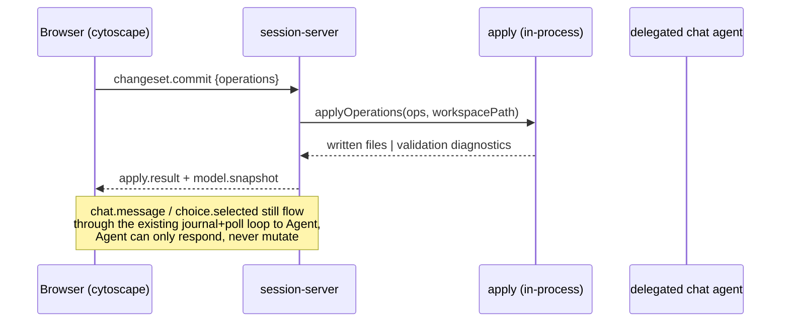

# Visual Cytoscape Native Editing Design

## Problem

`yarramate-visual` renders the model by generating `.c4`/`.likec4` DSL, shelling out to the `likec4` CLI, and displaying the compiled output through `likec4/react`'s `ReactLikeC4`. The browser is read-only: selecting a node or edge opens an inspector, but no editing surface exists anywhere in the current UI. The only mutation path is `model.replace`, issued by the delegated chat agent after a conversational turn — never initiated by the browser directly (ADR 0081).

As models grow, users need to inspect and edit concepts/relationships directly on the diagram, and need a layout that survives regeneration so a manually decluttered large graph doesn't reshuffle on every reload. Both require the browser to author structural changes and to persist presentation state — capabilities the current read-only, DSL-round-trip, agent-mediated architecture does not have.

## Decision

Replace the LikeC4 DSL/compiler pipeline with direct client-side rendering of the native yarramate model via [cytoscape.js](https://github.com/cytoscape/cytoscape.js), and add a browser-authored mechanical edit path that lands through `yarramate apply` — never through the chat agent. Chat is retained but demoted to a read-only view controller.

**Untouched, different feature:** `src/adapters/likec4-cli.ts`, `likec4-export.ts`, `likec4-project.ts`, `likec4-prepare.ts` (top-level, not under `src/adapters/visual/`) back the standalone `yarramate-likec4` binary and `yarramate export --kind likec4` — a static LikeC4-project-file generator for people who want to feed LikeC4's own tooling. Different consumers, out of scope. `likec4` / `@likec4/core` stay in `package.json` for that path.

**Deleted:** `src/adapters/visual/likec4-compiler.ts`, its `CompiledVisualModel` type and the `.likec4-export.json` staging step in `session-server.ts`, `likec4/react`'s `ReactLikeC4` usage in `src/visual-app/App.tsx`, and the `model.replace`-from-agent mutation path. React itself stays for the app shell (inspector forms, chat panel); only the diagram canvas component changes.

## Architecture

### Rendering

- cytoscape.js core renders the native graph-v2 model directly — no DSL round-trip, no CLI shell-out.
- Layout backends map onto the existing `presentation.layout` enum (`schema/yarramate-projection.schema.json`): `cytoscape-elk` for `layered` (Sugiyama family, same as Graphviz `dot` — measured 25% shorter total edge length than `cytoscape-dagre` on an 18-node/24-edge comparison graph), built-in `concentric` for `radial`, `cytoscape-cola` for `force`.
- Model is confirmed flat (`schema/yarramate-document.schema.json`): composition/aggregation are typed relationship kinds, not containment. No compound/nested cytoscape nodes are needed.

### Editing

- Editing is mechanical: structured operations (rename, retype, edit description, add/remove a relationship, reconnect an edge endpoint) via dropdown-constrained fields, never free text against an LLM.
- Full field coverage from day one: concepts get all 13 fields (`id`, `kind`, `name`, `description`, `aka[]`, `status`, `owner`, `distinctFrom[]`, `supersedes[]`, `constraints[]`, `references[]`, `presentIn[]`, `attestations[]`); relationships get all 10 (`id`, `kind`, `from`, `to`, `name`, `description`, `mode`, `content`, `references[]`, `presentIn[]`). Structured array fields (`constraints`, `attestations`, `references`, `aka`, `distinctFrom`, `supersedes`) get repeatable-row form controls, not deferred to a later phase.
- Reconnecting an edge endpoint (dragging `from`/`to`) needs no schema change: `update-relationship`'s `relationshipFields` already permits replacing `from`/`to` (`schema/yarramate-operations.schema.json`, scalars replace per ADR 0057).
- Edits accumulate client-side as a list of `yarramate/operations/v1` entries (a changeset) until the user presses **Commit changes**.
- No ad-hoc/scratch mode. The tool always targets a real canonical workspace; the existing ad-hoc rendering path is removed entirely.

### Commit

- **Commit changes** sends the accumulated changeset to the server, which validates and writes files via `yarramate apply` — and stops there. It does not run `git commit`. The result is an ordinary uncommitted working-tree diff, reviewed and committed through normal git flow like any other change today (unchanged from the existing chat-mediated commit behavior).
- `src/apply-command.ts:478-844`'s `runApplyCommand` is currently CLI-shaped (paths in, `CliResult` out). Extract a programmatic core — `applyOperations(operations, workspacePath) → { written[] } | { diagnostics[] }` — that both the CLI wrapper and the new commit handler call. No shell-out, no temp files, no dependency on process argv.

### Chat

- Chat keeps a narrower, read-only role: explain a node, filter, focus. It can never author a mutation again — `model.replace` from the delegated agent is removed entirely.
- The existing journal/poll/response loop in `session-server.ts` (`admitBrowserInput`, `deliverable`/`takeDelivery`, `answerPoll`, `acceptResponse`) stays exactly as-is for `chat.message`/`choice.selected`, since chat remains agent-mediated for its narrowed purpose.
- Chat-as-controller UX (how explain/filter/focus actually manifests on the canvas) is out of scope for this design — a separate follow-up brainstorm, already flagged during design.

### Layout persistence

- Manually dragged node positions persist as a new git-committed adapter-owned document: `.yarramate/visual-layout/<projection-id>.yaml`, format `yarramate/visual-layout/v1`, shape `{ format, projectionId, positions: { [subjectId]: { x, y } } }`.
- Written by a plain `writeFileSync` on `layout.save` — adapter-owned presentation state (ADR 0023), never validated by Core or routed through `apply`. Lands as the same kind of uncommitted working-tree diff as a model commit.
- Keyed per-projection: the same concept can sit at different positions in different diagram views.
- Deliberately not placed under `.yarramate-out/` (ADR 0027: that tree is gitignored and "must not become canonical input") — a gitignored cache would not reproduce for a teammate on a fresh clone, which defeats the stated requirement.
- Concepts absent from the sidecar (new since the last save) fall through to auto-layout at render time; concepts present in the sidecar stay pinned at their saved position.
- `layout.save` fires independently of the model changeset: debounced on drag-end for whichever node just moved, not gated behind **Commit changes**. Layout is presentation-only and carries no Core validation risk, so there is no reason to hold a manual arrangement hostage to an unrelated pending model edit, or lose it if the user closes the tab before committing.

## Wire protocol v2

Protocol version bump is required: the current v1 schema (`schema/yarramate-visual-event.schema.json`) has exactly four browser→server event types and no browser-authored mutation event.

Browser → server:

| Event | Status | Purpose |
|---|---|---|
| `chat.message` | unchanged shape, narrowed meaning | view-only: explain/filter/focus |
| `choice.selected` | unchanged | |
| `view.navigate` | repurposed | switch active projection |
| `changeset.commit` | **new** | `{ operations: YarramateOperation[] }` — the only mutation entrypoint |
| `layout.save` | **new** | `{ projectionId, positions: Record<subjectId, {x, y}> }` |
| `session.end` | unchanged | |

Server → browser:

| Response | Status | Purpose |
|---|---|---|
| `model.snapshot` | **new**, replaces `model.replace` | full graph-v2 JSON + presentation + saved layout for the active projection; sent on connect and after every successful commit |
| `apply.result` | **new** | reuses `schema/yarramate-apply-result.schema.json` shape: written-file list on success, or validation diagnostics verbatim (ADR 0062 — the browser shows exactly what landed, never an optimistic local guess) |
| `chat.response`, `choice.present`, `diagnostic`, `handoff.complete` | unchanged | still agent-mediated via the existing journal/poll loop |

`changeset.commit` and `layout.save` are handled synchronously in `session-server.ts`, bypassing the agent poll loop entirely — that loop stays reserved for chat turns.

## Data Flow

## Error Handling

Validation failures from `applyOperations` return diagnostics in the same shape `yarramate check`/`yarramate apply --json` already produce. The browser renders them against the changeset that produced them and leaves the changeset intact (not discarded) so the user can correct the offending field and retry, rather than losing the whole edit session on one rejected field.

## Verification

- Unit coverage for the extracted `applyOperations` core: same fixtures `runApplyCommand`'s existing tests use, called without going through CLI argv/paths.
- Protocol-contract tests for `changeset.commit` → `apply.result`/`model.snapshot`, and `layout.save` → sidecar file round-trip, mirroring the existing `chat.message`/`model.replace` test coverage in `src/adapters/visual/`.
- Browser smoke test: open a session, drag a node, commit a rename through the inspector, confirm the working tree shows exactly the expected file diff and no `git commit` was made, reload the session and confirm the dragged position and the rename both reproduce.

## Non-goals

- Chat-as-controller interaction design (explain/filter/focus UX) — separate follow-up brainstorm.
- Inline validation-diagnostic presentation (toast vs. inline vs. panel) — implementation detail, not architecture.
- Multi-tab/concurrent-edit conflict resolution — not raised; single-writer working-tree model assumed, same as today.
- Any change to `src/adapters/likec4-cli.ts`/`likec4-export.ts`/`likec4-project.ts`/`likec4-prepare.ts` or the `yarramate export --kind likec4` feature.
