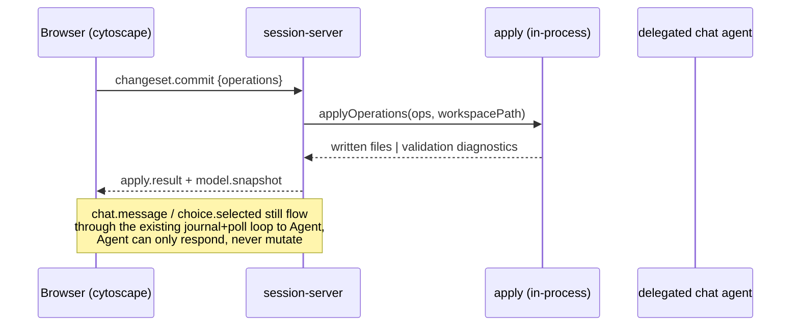

# Visual Cytoscape Native Editing Design

## Problem

`yarramate-visual` renders the model by generating `.c4`/`.likec4` DSL, shelling out to the `likec4` CLI, and displaying the compiled output through `likec4/react`'s `ReactLikeC4`. The browser is read-only: selecting a node or edge opens an inspector, but no editing surface exists anywhere in the current UI. The only mutation path is `model.replace`, issued by the delegated chat agent after a conversational turn — never initiated by the browser directly (ADR 0081).

As models grow, users need to inspect and edit concepts/relationships directly on the diagram, and need a layout that survives regeneration so a manually decluttered large graph doesn't reshuffle on every reload. Both require the browser to author structural changes and to persist presentation state — capabilities the current read-only, DSL-round-trip, agent-mediated architecture does not have.

## Decision

Replace the LikeC4 DSL/compiler pipeline with direct client-side rendering of the native yarramate model via [cytoscape.js](https://github.com/cytoscape/cytoscape.js), and add a browser-authored mechanical edit path that lands through `yarramate apply` — never through the chat agent. Chat is retained but demoted to a read-only view controller.

**Untouched, different feature:** `src/adapters/likec4-cli.ts`, `likec4-export.ts`, `likec4-project.ts`, `likec4-prepare.ts` (top-level, not under `src/adapters/visual/`) back the standalone `yarramate-likec4` binary and `yarramate export --kind likec4` — a static LikeC4-project-file generator for people who want to feed LikeC4's own tooling. Different consumers, out of scope. `likec4` / `@likec4/core` stay in `package.json` for that path.

**Deleted:** `src/adapters/visual/likec4-compiler.ts`, its `CompiledVisualModel` type and the `.likec4-export.json` staging step in `session-server.ts`, `likec4/react`'s `ReactLikeC4` usage in `src/visual-app/App.tsx`, and the `model.replace`-from-agent mutation path. React itself stays for the app shell (inspector forms, chat panel); only the diagram canvas component changes.

## Architecture

### Rendering

- cytoscape.js core renders the native graph-v2 model directly — no DSL round-trip, no CLI shell-out.
- Layout backends map onto the existing `presentation.layout` enum (`schema/yarramate-projection.schema.json`): `cytoscape-elk` for `layered` (Sugiyama family, same as Graphviz `dot` — measured 25% shorter total edge length than `cytoscape-dagre` on an 18-node/24-edge comparison graph), built-in `concentric` for `radial`, `cytoscape-cola` for `force`.
- Model is confirmed flat (`schema/yarramate-document.schema.json`): composition/aggregation are typed relationship kinds, not containment. No compound/nested cytoscape nodes are needed.

### Notation (ArchiMate-style view mode)

A fourth toggle, orthogonal to the layout-algorithm toggle (`layered`/`radial`/`force`): **Native** (current flat kind-colored render) or **ArchiMate**. Selecting ArchiMate forces the layout backend to `cytoscape-elk` with `elk.layered.direction: DOWN` regardless of the projection's stored `presentation.layout`, because swimlanes only make sense top-down; switching back to Native restores whatever the projection specifies.

**Grounding:** 17 of 19 concept kinds and 9 of 10 relationship kinds in the actual repo graph (`yarramate export graph`) already match ArchiMate 3.2 element/relationship names verbatim (`implements`, the 10th, is already mapped to Realization in `docs/ADAPTER-MAPPINGS.md:291-292`). This is a styling layer on the existing kind vocabulary, not a new modeling concept — no schema change, no new relationship kinds.

**Licensing (`docs/BACKLOG-DISPOSITION.md:56-57`, verified against Open Group terms):** the visual notation itself (shapes, layer colors, line/arrowhead conventions) is freely implementable by anyone. Only the ArchiMate® trademark and "Certified"/conformance claims are restricted. This design implements descriptive ArchiMate-*style* notation only — no certification claim, no "compatibility profile" governance. That larger conversation stays out of scope, per `BACKLOG-DISPOSITION.md`'s existing external-block note.

**Layer bands** (top→bottom row per band, via per-node `elk.partitioning.partition` + `elk.partitioning.activate: true`; `elk.separateConnectedComponents: false` is required — ELK lays out disconnected subgraphs independently by default, which breaks global band ordering on a graph this sparse):

| Band (community color) | Yarramate kinds | Shape |
|---|---|---|
| Motivation (purple) | `requirement`, `goal`, `driver` | cut-rectangle |
| Strategy (tan) | `capability` | round-rectangle |
| Business (yellow) | `businessActor` (rectangle), `businessFunction` (round-rectangle), `representation` (bottom-round-rectangle) | mixed |
| Application (blue) | `applicationComponent`/`dataObject` (rectangle), `applicationFunction`/`applicationService` (round-rectangle) | mixed |
| Technology (green) | `node`/`systemSoftware`/`artifact` (rectangle), `technologyFunction` (round-rectangle) | mixed |
| Implementation & Migration (pink) | `plateau`, `deliverable` | rectangle |
| Implementation source (7th band, no ArchiMate equivalent) | `repository-file` (86 instances — the single largest kind), `compiler-module` | rectangle |

Full shape fidelity, not color-only approximation: cytoscape.js ships the needed shapes as built-ins — `rectangle`, `round-rectangle`, `cut-rectangle` (diagonal-cut corner, exact Motivation-layer match), `bottom-round-rectangle` (scalloped-bottom approximation for Representation) (`cytoscape/cytoscape.js` `src/extensions/renderer/base/node-shapes.mjs:444-450` for `bottom-round-rectangle`; full built-in shape enum in `index.d.ts`). No custom shape rendering needed.

**Relationship line/arrowhead mapping** (`source-arrow-shape`/`fill`, `target-arrow-shape`/`fill`, `line-style` — all built-in cytoscape.js edge style properties):

| Relationship kind | Line | Arrowhead |
|---|---|---|
| `composition` | solid | filled diamond @ source |
| `assignment` | solid | filled circle @ target |
| `realization`, `implements` | dashed | hollow triangle @ target |
| `serving` | solid | hollow triangle @ target |
| `access` | dotted | none |
| `influence` | dashed | hollow vee @ target |
| `triggering` | solid | filled triangle @ target |
| `flow` | dashed | filled triangle @ target |
| `association` | solid | none |

**Icons:** ~19 hand-authored single-color 12×12 SVGs, one per concept kind, composited via `background-image`/`background-position-x/y`/`background-width/height` over the shape fill — not sourced from Archi or a third-party icon set, to avoid an unverified-license dependency for something cheap to own outright.

**Verified against the live model:** rendered the actual 242-concept/330-relationship graph from this repo (`yarramate export graph`) through this exact configuration — zero console errors, all layer bands strictly non-overlapping in the vertical axis (motivation through implementation-source, top to bottom).

### Views (saved projections)

- Views are yarramate's existing `yarramate/projection/v1` documents (`schema/yarramate-projection.schema.json`) — not a new concept. This repo's `.yarramate/projections/*.yaml` already stores 21 real ones (e.g. `starter-application-cooperation.yaml`). The redesign adds a browser-native way to author, apply, and save them; it introduces no new schema.
- **View picker:** toolbar dropdown listing `id`/`title`/`description` for every document under `.yarramate/projections/` (session server reads the directory on load, sends `{ id, title, description, query, presentation }` per view to the browser). "All (unfiltered)" is pinned at the top as the non-saved default state.
- Selecting a view applies its `query` to filter the canvas (same hide/show mechanic the free-text quick-filter already has — `rel:connected`/`rel:between`/`none`, matched-node vs neighbor vs isolate) and applies its `presentation.layout`/`direction` (auto-switches the layout picker to match). Loading a view never mutates the model — filters and layout only.
- The free-text quick-filter box already in the mockup stays as-is: **client-side, ephemeral** — narrows by name/id substring on top of whatever view is loaded. It is never what gets saved; it's search, not a view definition.
- A real **structured filter panel** (multi-select, kind-aware) is what actually composes/edits a view's `query` — the schema has 13 typed query dimensions: `subjects`/`documents` (id lists), `kinds`/`relationshipKinds` (qualified-kind strings, `kindMatching: exact|descendants`), `layers`, `statuses`/`excludeStatuses` (`planned|current|retired`), `states`/`owners`/`constraints` (subject-identity lists), `relationships` (`between|connected|none`), `isolatedConcepts` (`include|exclude`). A plain text box can't author this faithfully.
- **Save As** writes `{id}.projection.yaml` directly to `.yarramate/projections/` — the same direct-filesystem-write precedent already approved for `layout.save`, not routed through `apply`, since projections aren't graph-v2 concepts/relationships. **Save** overwrites the currently loaded view's file. Both are gated behind the same new-file/overwrite confirm affordance as Commit — never silent.
- `presentation.title`/`description`/`layout`/`direction`/`seed` map onto the Save-As form: the layout/direction pickers already on the toolbar, plus two new text fields (title, description) prompted at Save-As time.

### Status/evidence/ownership badges

- Three `presentation` booleans already exist in the schema, currently unrendered: `showLifecycle`, `showEvidence`, `showOwnership`. This design gives them a renderer: independent per-node badge overlays layered on top of the shape fill and kind glyph.
- Mechanism, verified in a synthetic harness against representative data (rendered screenshot, zero console errors): cytoscape.js array-valued style properties (`background-image`/`-width`/`-height`/`-position-x/y`/`-image-opacity`, each a same-length array with one entry per badge) layer arbitrary numbers of independent images per node — no compound nodes, no CORS issues (SVG `data:` URIs, not external files).
- Layout: top-right = kind glyph (always on, existing icon system), top-left = lifecycle dot (green filled = current, hollow ring = planned, gray filled = retired) shown only when `showLifecycle`, bottom-left = evidence check shown only when `showEvidence && attestations.length > 0`, bottom-right = owner-initials chip (colored circle) shown only when `showOwnership && owner` is set. Each badge's opacity is gated independently by its own presentation flag *and* underlying data presence — `showEvidence: true` on a concept with no attestations renders nothing, not an empty slot.
- The three toggles are Structured-filter-panel checkboxes, not query filters — they're presentation, saved the same way `layout`/`direction` already are.
- Owner-chip color: deterministic hash of the concept's `owner` field onto the fixed Apple-system palette already used across the mockups (`--accent`/`--success`/`--warning`/`--error` family) — same no-invented-palette discipline as the ArchiMate layer-band colors.

### Editing

- Editing is mechanical: structured operations (rename, retype, edit description, add/remove a relationship, reconnect an edge endpoint) via dropdown-constrained fields, never free text against an LLM.
- Full field coverage from day one: concepts get all 13 fields (`id`, `kind`, `name`, `description`, `aka[]`, `status`, `owner`, `distinctFrom[]`, `supersedes[]`, `constraints[]`, `references[]`, `presentIn[]`, `attestations[]`); relationships get all 10 (`id`, `kind`, `from`, `to`, `name`, `description`, `mode`, `content`, `references[]`, `presentIn[]`). Structured array fields (`constraints`, `attestations`, `references`, `aka`, `distinctFrom`, `supersedes`) get repeatable-row form controls, not deferred to a later phase.
- Reconnecting an edge endpoint (dragging `from`/`to`) needs no schema change: `update-relationship`'s `relationshipFields` already permits replacing `from`/`to` (`schema/yarramate-operations.schema.json`, scalars replace per ADR 0057).
- Edits accumulate client-side as a list of `yarramate/operations/v1` entries (a changeset) until the user presses **Commit changes**.
- No ad-hoc/scratch mode. The tool always targets a real canonical workspace; the existing ad-hoc rendering path is removed entirely.

### Commit

- **Commit changes** sends the accumulated changeset to the server, which validates and writes files via `yarramate apply` — and stops there. It does not run `git commit`. The result is an ordinary uncommitted working-tree diff, reviewed and committed through normal git flow like any other change today (unchanged from the existing chat-mediated commit behavior).
- `src/apply-command.ts:478-844`'s `runApplyCommand` is currently CLI-shaped (paths in, `CliResult` out). Extract a programmatic core — `applyOperations(operations, workspacePath) → { written[] } | { diagnostics[] }` — that both the CLI wrapper and the new commit handler call. No shell-out, no temp files, no dependency on process argv.

### Chat (interaction design)

- Chat is a read-only front end onto the same query/filter/focus mechanisms already available to a human via the view picker, structured filter panel, and canvas isolate/focus action — it never triggers a canvas action the user couldn't already trigger by hand, and it can never author a mutation again (`model.replace` from the delegated agent is removed entirely).
- **Explain:** the delegated agent resolves the request the same way `yarramate ask <workspace> "<free text>"` already does server-side — free text matches concept ids/names/descriptions, seeding a connected slice via `evaluateProjection` with ADR 0070's neighbour cap (`src/ask-command.ts`'s `sliceProjection`). It answers in grounded prose over `chat.response.text`, unchanged shape. No canvas change.
- **Filter/focus:** the agent additionally resolves the request into a `yarramate/projection/v1` `query` object — the identical object `sliceProjection` already builds internally (`{ subjects: [...seeds], relationships: 'connected' }` for "focus on Checkout Service"; the full 13-dimension query for an explicit filter like "show only the application layer" → `{ layers: ['application'] }`). This is the same engine and schema the Views feature and the existing `yarramate_ask` MCP tool already use — no new interpretation machinery.
- **Protocol:** `chatResponsePayload` (`schema/yarramate-visual-response.schema.json`) gains one optional field, `appliedQuery: ProjectionQuery` — additive, folded into the already-planned v2 bump, no new response type.
- Applying `appliedQuery` is not model authority — ADR 0081's closed-contract concern is model canonicity, not view state — so the browser applies it immediately on receipt, same hide/show mechanic as the view picker and structured filter panel (`.hide()`/`.show()`, never dimming), with a visible **"Filtered by chat: `<label>` · Show all"** pill (same precedent as the "Layout saved" pill) so the narrowing is never silent. "Show all", or any manual filter-panel/view-picker action, clears it.
- Chat-applied filters are always ephemeral: they never write to `.yarramate/projections/`. Keeping one is the existing **Save As** action — identical to saving a manually-built filter.
- The existing journal/poll/response loop in `session-server.ts` (`admitBrowserInput`, `deliverable`/`takeDelivery`, `answerPoll`, `acceptResponse`) stays exactly as-is for `chat.message`/`choice.selected`; only the response payload the agent constructs gains the optional `appliedQuery` field.
- No new server-side capability to build: the agent already has `yarramate_ask` as an MCP tool; wiring its resolved query into the visual-response payload is the only change (`session-server.ts` response construction), not a new resolution engine.

### Layout persistence

- Manually dragged node positions persist as a new git-committed adapter-owned document: `.yarramate/visual-layout/<projection-id>.yaml`, format `yarramate/visual-layout/v1`, shape `{ format, projectionId, positions: { [subjectId]: { x, y } } }`.
- Written by a plain `writeFileSync` on `layout.save` — adapter-owned presentation state (ADR 0023), never validated by Core or routed through `apply`. Lands as the same kind of uncommitted working-tree diff as a model commit.
- Keyed per-projection: the same concept can sit at different positions in different diagram views.
- Deliberately not placed under `.yarramate-out/` (ADR 0027: that tree is gitignored and "must not become canonical input") — a gitignored cache would not reproduce for a teammate on a fresh clone, which defeats the stated requirement.
- Concepts absent from the sidecar (new since the last save) fall through to auto-layout at render time; concepts present in the sidecar stay pinned at their saved position.
- `layout.save` fires independently of the model changeset: debounced on drag-end for whichever node just moved, not gated behind **Commit changes**. Layout is presentation-only and carries no Core validation risk, so there is no reason to hold a manual arrangement hostage to an unrelated pending model edit, or lose it if the user closes the tab before committing.

## Wire protocol v2

Protocol version bump is required: the current v1 schema (`schema/yarramate-visual-event.schema.json`) has exactly four browser→server event types and no browser-authored mutation event.

Browser → server:

| Event | Status | Purpose |
|---|---|---|
| `chat.message` | unchanged shape, narrowed meaning | view-only: explain/filter/focus |
| `choice.selected` | unchanged | |
| `view.navigate` | repurposed | switch active projection |
| `changeset.commit` | **new** | `{ operations: YarramateOperation[] }` — the only mutation entrypoint |
| `layout.save` | **new** | `{ projectionId, positions: Record<subjectId, {x, y}> }` |
| `session.end` | unchanged | |

Server → browser:

| Response | Status | Purpose |
|---|---|---|
| `model.snapshot` | **new**, replaces `model.replace` | full graph-v2 JSON + presentation + saved layout for the active projection; sent on connect and after every successful commit |
| `apply.result` | **new** | reuses `schema/yarramate-apply-result.schema.json` shape: written-file list on success, or validation diagnostics verbatim (ADR 0062 — the browser shows exactly what landed, never an optimistic local guess) |
| `chat.response` | payload gains optional `appliedQuery` | narrowed meaning: explain/filter/focus, never mutation; `appliedQuery` (when present) is a `projection.query` the browser applies immediately as an ephemeral, non-saved filter |
| `choice.present`, `diagnostic`, `handoff.complete` | unchanged | still agent-mediated via the existing journal/poll loop |

`changeset.commit` and `layout.save` are handled synchronously in `session-server.ts`, bypassing the agent poll loop entirely — that loop stays reserved for chat turns.

## Data Flow

## Error Handling

Validation failures from `applyOperations` return diagnostics in the same shape `yarramate check`/`yarramate apply --json` already produce. The browser renders them against the changeset that produced them and leaves the changeset intact (not discarded) so the user can correct the offending field and retry, rather than losing the whole edit session on one rejected field.

## Verification

- Unit coverage for the extracted `applyOperations` core: same fixtures `runApplyCommand`'s existing tests use, called without going through CLI argv/paths.
- Protocol-contract tests for `changeset.commit` → `apply.result`/`model.snapshot`, and `layout.save` → sidecar file round-trip, mirroring the existing `chat.message`/`model.replace` test coverage in `src/adapters/visual/`.
- Browser smoke test: open a session, drag a node, commit a rename through the inspector, confirm the working tree shows exactly the expected file diff and no `git commit` was made, reload the session and confirm the dragged position and the rename both reproduce.
- Notation-mode smoke test: toggle Native → ArchiMate on a live session, confirm the layout backend switches to `cytoscape-elk`/`DOWN`/partitioned regardless of the projection's stored `presentation.layout`, and confirm layer bands render strictly top-to-bottom with no vertical overlap; toggle back to Native and confirm the projection's own layout setting is restored.

## Non-goals

- Inline validation-diagnostic presentation (toast vs. inline vs. panel) — implementation detail, not architecture.
- Multi-tab/concurrent-edit conflict resolution — not raised; single-writer working-tree model assumed, same as today.
- Any change to `src/adapters/likec4-cli.ts`/`likec4-export.ts`/`likec4-project.ts`/`likec4-prepare.ts` or the `yarramate export --kind likec4` feature.
- ArchiMate® Tool Certification or any compatibility-profile/conformance claim — this design renders descriptive ArchiMate-*style* notation only, never asserts certified conformance to the Open Group specification.
